This is a solid scaffold. Let me read through all five files carefully before writing the plan.

The architecture is already very coherent:

- `mod.rs` — `MastertechPlugin` trait + `PluginManager` + `PluginManagerHandle` (egui bridge)
- `host.rs` — `PluginHost` + `PluginEvent` channel system + snapshots
- `mcp_bridge.rs` — `PluginToolProvider` on TCP 9003 with list/enable/disable/call tools
- `remote.rs` — `EguiFrameCapture` / `EguiRemoteViewer` plugin pair (stub)
- `wasm.rs` — `WasmPlugin` / `WasmRuntime` structural stub

Here's the prioritized implementation plan:Here's the detailed breakdown of each phase:



**Phase 1 — Wire `wasm.rs` (highest leverage, everything else depends on it)**

`WasmPlugin::from_bytes` needs to actually compile the module and call the identity exports. The concrete steps: create `wasmtime::Module::new(&engine, &bytes)`, build a `Store<WasmPluginState>` with the event sender injected, define the three host imports (`host_log`, `host_emit_event`, `host_repaint`) as `wasmtime::Func`, instantiate, then call `plugin_id`/`plugin_name`/`plugin_version` via typed exports to fill the struct fields. The `Box::leak` on `id()` is a bug waiting to cause pain — replace it with an interned string slab (`once_cell::sync::Lazy<DashMap<String, &'static str>>`) or store the `&'static str` directly after interning on load. For the ABI, your existing MessagePack pipeline is the right choice — pass complex types as `(ptr: i32, len: i32)` pairs into WASM linear memory, using `wasmtime::Memory::write`.

**Phase 2 — MCP bridge expansion (`mcp_bridge.rs`)**

The four tools you need beyond the existing list/enable/disable/call are: `plugin_source` (read/write Rust source to a server-side store keyed by plugin ID), `plugin_compile` (shell out to `cargo build --target wasm32-wasip2` in a sandboxed temp dir, return the artifact bytes or structured compiler errors), `plugin_deploy` (call `PluginManager::unregister` then `load_wasm` with the new artifact — the hot-swap), and `plugin_watch` (collect `PluginEvent`s and frame timing over N frames into a `BehaviorReport`). Also add `plugin_rollback` — store the previous artifact ID alongside the current one in a simple `HashMap<String, Vec<u8>>` artifact store. The compiler sandbox is the security-critical piece: run it as a separate process with no network access except `crates.io`, `HOME` redirected to a temp dir, and a crate allowlist enforced via a custom `.cargo/config.toml` injected before compilation.

**Phase 3 — `PluginEvent` dispatch wiring (`mod.rs`)**

`process_events` currently only logs `RunScript` and `SendWsCommand`. To wire these without creating a circular dependency (plugin module importing your WS client), introduce an `EventDispatcher` trait:

```rust
pub trait EventDispatcher: Send + Sync + 'static {
    fn run_script(&self, client_id: &str, filename: &str, content: &str);
    fn send_ws_command(&self, client_id: &str, payload: &[u8]);
    fn show_notification(&self, title: &str, body: &str, kind: &NotificationKind);
}
```

Inject it at `PluginManager::new(dispatcher: Arc<dyn EventDispatcher>)`. Your app implements this trait and passes in an `Arc` — the plugin system stays clean of your WS/TCP internals. Also: `broadcast_tx` exists but `broadcast()` is never called from anywhere. You need to call it from your app's update loop when `ClientConnected`, `ClientDisconnected`, and `SystemInfoUpdated` events occur.

**Phase 4 — Remote viewer (`remote.rs`)**

The channel plumbing is there, the serialization gap is the only real work. `EguiFrameCapture::output_hook` needs to actually serialize `output.shapes` (a `Vec<ClippedShape>`) and `output.textures_delta` — the challenge is that `ClippedShape` doesn't implement `Serialize`. You'll need a mirror type (`WireShape`) that maps to/from it, or use `bincode` with a custom serializer. `TexturesDelta` has the same issue. On the viewer side, `EguiRemoteViewer::ui` needs to re-upload textures via `ctx.tex_manager().write().set(...)` before replaying shapes through `ctx.tessellate()` then `ui.painter().add_clipped_mesh()`. The input forwarding in `input_hook` is already structurally correct — it just needs the WebSocket receiver feeding `input_tx` from a background task.

The natural order to ship this is Phase 1 → Phase 3 → Phase 2 → Phase 4, because the MCP authoring loop (Phase 2) is only useful once WASM plugins actually execute (Phase 1), and the remote viewer (Phase 4) is independent but lower priority than the AI deployment loop.