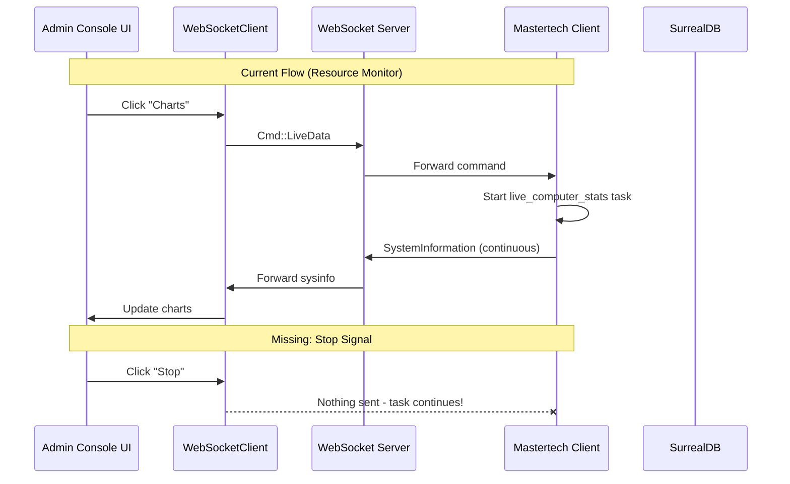

# Admin Console Fixes Plan

## Architecture Overview




---

## 1. Fix Resource Monitor Stop Button

**Problem**: Clicking "Stop" sets `ResourceMonitorState::Stop` locally but never sends `Cmd::Quit` to the Mastertech client, so `live_computer_stats` continues running.

**Files to modify**:

- `[displays/src/tabs/admin_console/client_interface/ui.rs](displays/src/tabs/admin_console/client_interface/ui.rs)` - Add "Stop" button that sends `Cmd::Quit`
- `[displays/src/tabs/admin_console/client_interface/tabs/resource_monitor.rs](displays/src/tabs/admin_console/client_interface/tabs/resource_monitor.rs)` - Remove local stop handling (already in dedicated tab version)

**Changes**:

- Add a "Stop Charts" button next to "Charts" that sends `Cmd::Quit` via `send_cmd_tx`
- Track whether live stats are currently active to show appropriate button

---

## 2. Implement Process Table Context Menu and Actions

**Problem**: `custom_context_menu_items` and `on_custom_action_ex` are commented out in the process table viewer.

**Files to modify**:

- `[displays/src/tabs/resource_monitor/process_table.rs](displays/src/tabs/resource_monitor/process_table.rs)` - Implement context menu
- `[displays/src/tabs/admin_console/client_interface/mod.rs](displays/src/tabs/admin_console/client_interface/mod.rs)` - Add channel for process actions
- `[Mastertech4.0/src/terminal_mode/websockets/mod.rs](Mastertech4.0/src/terminal_mode/websockets/mod.rs)` - Handle kill process command

**Changes**:

- Uncomment and implement `custom_context_menu_items` with "Kill Process" and "Open in Explorer" options
- Add new `Cmd::KillProcess(pid)` variant
- Handle kill process on client side using `taskkill` (Windows) or `kill` (Unix)

---

## 3. Add Process Table Refresh Rate

**Problem**: No way to control how often the process table updates.

**Files to modify**:

- `[displays/src/tabs/resource_monitor/process_table.rs](displays/src/tabs/resource_monitor/process_table.rs)` - Add refresh rate field and UI
- `[displays/src/tabs/resource_monitor/mod.rs](displays/src/tabs/resource_monitor/mod.rs)` - Use refresh rate in update logic

**Changes**:

- Add `refresh_rate_ms: u64` field to `ProcessTableViewer`
- Add a dropdown/slider in the top panel to select refresh rate (500ms, 1s, 2s, 5s)
- Track last update time and only update when interval elapsed

---

## 4. Rewrite "My Tools" Using SurrealDB Files API

**Problem**: Current implementation uses S3/Minio which is deprecated. SurrealDB 3.0.0-beta.1 has native files API.

**Files to modify**:

- `[displays/src/virtual_filesystem/mod.rs](displays/src/virtual_filesystem/mod.rs)` - Replace S3 calls with SurrealDB file functions
- `[database/src/lib.rs](database/src/lib.rs)` - Add bucket definition and file helper functions

**SurrealDB Files API** (from surrealdb crate):

```sql
-- Define a bucket (run once at setup)
DEFINE BUCKET tools;

-- File operations via SurrealQL functions:
file::put(f"tools:/scripts/myscript.ps1", $data)
file::get(f"tools:/scripts/myscript.ps1")
file::list(f"tools:/scripts/")
file::delete(f"tools:/scripts/myscript.ps1")
file::head(f"tools:/scripts/myscript.ps1")  -- metadata
```

**Changes**:

- Create a new `SurrealDbFileSystem` struct that implements file operations via SurrealDB
- Replace `S3Fetcher` with SurrealDB file queries
- Each user gets their own bucket: `DEFINE BUCKET user_{username}`
- Update `request_contents`, `upload`, `download_selection`, `delete_selection`

---

## 5. Rewrite "Explorer" with Websocket-Based Remote Filesystem

**Problem**: Explorer tries to use the VFS but it's clunky and doesn't work properly for browsing the actual remote filesystem.

**Files to modify**:

- `[displays/src/tabs/admin_console/client_interface/ui.rs](displays/src/tabs/admin_console/client_interface/ui.rs)` - Refactor Explorer tab
- `[displays/src/tabs/admin_console/client_interface/receive.rs](displays/src/tabs/admin_console/client_interface/receive.rs)` - Handle directory listing responses
- `[Mastertech4.0/src/terminal_mode/websockets/mod.rs](Mastertech4.0/src/terminal_mode/websockets/mod.rs)` - Implement directory listing
- `[displays/src/lib.rs](displays/src/lib.rs)` - Add new `Cmd` variants

**New Cmd Variants**:

```rust
pub enum Cmd {
    // ... existing variants
    ListDirectory(String),          // Request: path to list
    DirectoryListing(Vec<DirEntry>), // Response: entries
    DownloadFile(String),           // Request file download
    FileChunk(Vec<u8>, bool),       // Response: data, is_last
}
```

**Changes**:

- Create a simpler `RemoteExplorer` component (not the full VFS)
- When user clicks "Explorer", send `Cmd::ListDirectory("current")` 
- Mastertech responds with `Cmd::DirectoryListing(entries)`
- Display entries in a tree/list view with breadcrumb navigation
- Right-click actions: Download, Delete, Upload To

