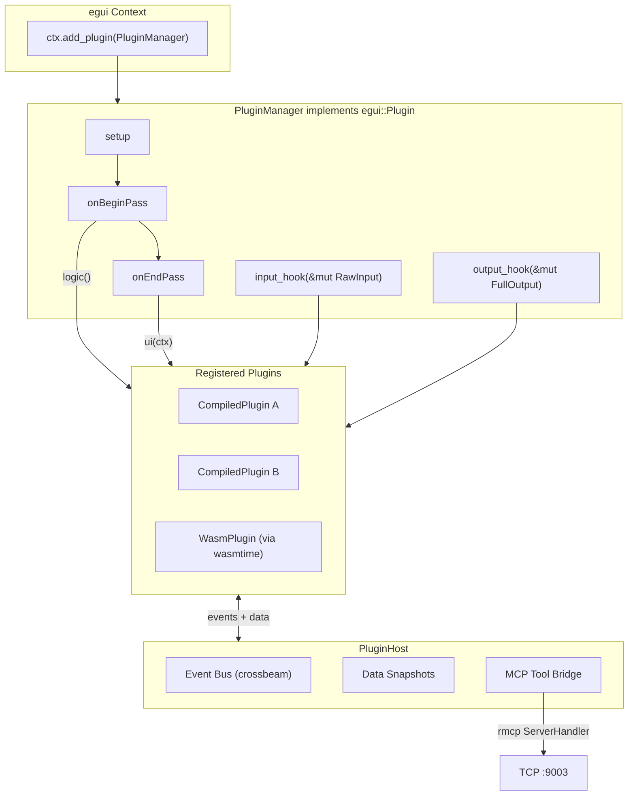

# Mastertech Plugin System Scaffold

## Architecture Overview

A single `PluginManager` registers itself as an `egui::Plugin` via `Context::add_plugin` and internally dispatches lifecycle hooks to all managed `MastertechPlugin` instances. Plugins communicate with the host app through a channel-based `PluginHost` API. MCP tools from plugins are aggregated into a dedicated `PluginToolProvider` (rmcp `ServerHandler`). WASM support is feature-gated behind `wasm-plugins`.



## File Structure

All new files live under `displays/src/plugins/`:

```
displays/src/plugins/
  mod.rs          - PluginManager (impl egui::Plugin), MastertechPlugin trait, re-exports
  host.rs         - PluginHost, PluginEvent, data snapshot types
  mcp_bridge.rs   - PluginToolProvider (rmcp #[tool_router] aggregating plugin tools)
  wasm.rs         - WasmRuntime + WasmPlugin adapter (behind #[cfg(feature = "wasm-plugins")])
  remote.rs       - EguiFrameCapture + EguiRemoteViewer types for egui-to-egui viewing
```

## Core Trait: `MastertechPlugin`

Defined in [displays/src/plugins/mod.rs](displays/src/plugins/mod.rs):

```rust
pub trait MastertechPlugin: Send + Sync + 'static {
    fn id(&self) -> &'static str;
    fn name(&self) -> &str;
    fn version(&self) -> &str;
    fn description(&self) -> &str { "" }
    fn enabled(&self) -> bool { true }

    fn on_load(&mut self, host: &PluginHost) {}
    fn on_unload(&mut self) {}

    // Called during on_begin_pass -- pure data/logic, no UI
    fn logic(&mut self, host: &PluginHost) {}

    // Called during on_end_pass -- may render UI (Windows, Panels, overlays)
    fn ui(&mut self, ctx: &egui::Context, host: &PluginHost) {}

    // egui hooks (forwarded from PluginManager)
    fn input_hook(&mut self, _input: &mut egui::RawInput) {}
    fn output_hook(&mut self, _output: &mut egui::FullOutput) {}

    // MCP tool registration -- return empty vec if plugin has no tools
    fn mcp_tools(&self) -> Vec<PluginToolDescriptor> { vec![] }
    fn handle_mcp_call(&mut self, tool: &str, args: serde_json::Value)
        -> Result<serde_json::Value, String> { Err(format!("No tool: {tool}")) }
}
```

## PluginManager

Defined in [displays/src/plugins/mod.rs](displays/src/plugins/mod.rs). Implements `egui::Plugin`, owns all plugin instances and the shared `PluginHost`:

- `setup()` -- stores `ctx.clone()` in host, calls `on_load` for each plugin
- `on_begin_pass()` -- updates host data snapshots from incoming events, then calls `plugin.logic()` for each enabled plugin
- `on_end_pass()` -- calls `plugin.ui(ctx, &host)` for each enabled plugin
- `input_hook()` / `output_hook()` -- forwarded to all enabled plugins
- Public methods: `register(Box<dyn MastertechPlugin>)`, `unregister(id)`, `get_plugin(id)`, `list_plugins()`

## PluginHost

Defined in [displays/src/plugins/host.rs](displays/src/plugins/host.rs). The API surface plugins use:

- **Event bus**: `crossbeam::channel::Sender<PluginEvent>` for plugins to emit events, `Receiver<PluginEvent>` for the manager to dispatch
- **Data snapshots** (read-only structs updated by the manager each frame): system info, connected clients, current user, current store
- **Convenience methods**: `request_repaint()`, `send_notification(title, body, kind)`, `run_remote_script(client_id, filename, content)`

`PluginEvent` enum covers both directions:

- Plugin -> Host: `RequestRepaint`, `ShowNotification`, `RunScript`, `SendWsCommand`, `Custom { plugin_id, event_type, data }`
- Host -> Plugin (via a separate broadcast channel or polling): `ClientConnected`, `ClientDisconnected`, `SystemInfoUpdated`, `ScriptCompleted`

## MCP Bridge

Defined in [displays/src/plugins/mcp_bridge.rs](displays/src/plugins/mcp_bridge.rs):

- `PluginToolProvider` struct with `#[tool_router]` and `impl ServerHandler`
- Holds `Arc<Mutex<PluginManager>>` (or channel reference) to route MCP calls
- Built-in tools: `list_plugins`, `enable_plugin`, `disable_plugin`, `call_plugin_tool`
- `call_plugin_tool` takes `plugin_id`, `tool_name`, `args` and dispatches to `plugin.handle_mcp_call()`
- Binds on TCP **9003** (new port, separate from existing 9001/9002)
- Started alongside existing MCP servers from [Mastertech4.0/src/main.rs](Mastertech4.0/src/main.rs)

## WASM Stub

Defined in [displays/src/plugins/wasm.rs](displays/src/plugins/wasm.rs), gated behind `#[cfg(feature = "wasm-plugins")]`:

- `WasmRuntime` struct wrapping `wasmtime::Engine` + `wasmtime::Store`
- `WasmPlugin` struct implementing `MastertechPlugin` by calling into WASM exports
- ABI contract (documented as comments/consts): the WASM module must export `plugin_id`, `plugin_name`, `plugin_version`, `on_load`, `on_unload`, `logic`, `ui_commands` (returns serialized draw commands instead of direct egui calls)
- `PluginManager::load_wasm(bytes: Vec<u8>)` method to instantiate a `WasmPlugin` from raw WASM bytes
- Feature flag: `wasmtime = { version = "...", optional = true }` in [displays/Cargo.toml](displays/Cargo.toml) under `[features] wasm-plugins = ["wasmtime"]`

Not fully functional yet -- the ABI and draw-command protocol are defined as types/constants but not implemented. This gives a clear contract to build against.

## Egui-to-Egui Remote Viewing

Defined in [displays/src/plugins/remote.rs](displays/src/plugins/remote.rs):

- `EguiFrameCapture` -- a plugin that uses `output_hook` to capture `egui::FullOutput` (shapes, textures_delta, platform_output), serializes to a `EguiFrameMessage` (analogous to existing `BufferMessage` for ratatui), compresses with zstd, and sends via a channel
- `EguiRemoteViewer` -- a plugin that receives `EguiFrameMessage` over WebSocket, deserializes, and replays the paint list using `ctx.debug_painter()` or a custom rendering approach
- `EguiFrameMessage` struct: `frame_count: u64`, `timestamp: u128`, `shapes: Vec<egui::epaint::ClippedShape>`, `textures_delta: egui::TexturesDelta`
- Input forwarding: `EguiRemoteViewer` captures local input events (mouse, keyboard) and sends them as `EguiInputEvent` messages to the remote host, which injects them via `input_hook`
- Reuses the existing WebSocket transport pattern from [displays/src/remote_viewer/mod.rs](displays/src/remote_viewer/mod.rs)

These types are defined but the full serialization/transport pipeline is a stub for now.

## Files to Modify

- [displays/src/lib.rs](displays/src/lib.rs) -- add `pub mod plugins;`
- [displays/Cargo.toml](displays/Cargo.toml) -- add `wasmtime` as optional dep, `wasm-plugins` feature
- [Cargo.toml](Cargo.toml) (workspace) -- add `wasmtime` to workspace deps
- [Mastertech4.0/src/app_state.rs](Mastertech4.0/src/app_state.rs) -- add `plugin_manager: Arc<Mutex<PluginManager>>` to `MastertechContext`
- [Mastertech4.0/src/main.rs](Mastertech4.0/src/main.rs) -- in `fn logic`, call `ctx.add_plugin(plugin_manager)` during first-run (one-time registration); spawn plugin MCP server on 9003

## Key Design Decisions

- **Single egui::Plugin bridge**: Only `PluginManager` touches `Context::add_plugin`. Individual `MastertechPlugin`s never register directly -- this avoids ordering issues and gives the manager full control
- **Separation of logic/ui in plugins**: Mirrors the `fn logic` / `fn ui` split we just implemented for the app itself. `logic()` runs in `on_begin_pass` (no UI), `ui()` runs in `on_end_pass` (can render)
- **Feature-gated WASM**: `wasmtime` is heavy (~50MB compile artifact). Keeping it behind a feature means normal builds are unaffected
- **Dedicated MCP port (9003)**: Keeps plugin tools separate from desktop tools (9001) and diagnostic tools (9002), avoidng conflicts
- **Channel-based host API**: Same crossbeam pattern used throughout the codebase. Plugins never get mutable access to `SharedContext` directly -- they go through events
