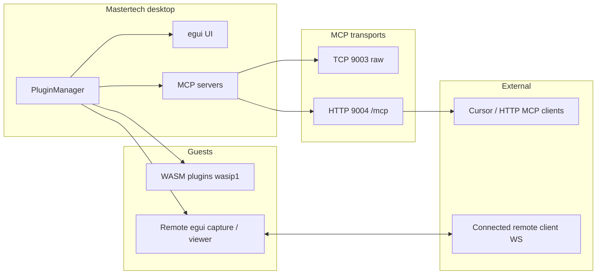

# Mastertech plugins, MCP, and AI integration

This document describes how the **plugin system**, **Model Context Protocol (MCP)**, **WASM guests**, and **remote egui** fit together—what works today, what is in progress, and what is planned. It reflects the workflow and goals discussed for grounding shop-side AI in **real machine and service history**, not only the current session.

---

## Product context

- **Who uses Mastertech:** Technicians working on **customer machines** in the shop. The customer does not run the app; installs are **removed when service ends**.
- **Core workflow:** Diagnose on the PC → produce and send a **TUR sheet** (recommendations, hardware checks, task linkage) via the **TUR Sheet** tab (`Mastertech4.0/src/tabs/tur_sheet`).
- **Why AI/plugins matter:** The model should be grounded in **shop history** for **this computer**: prior visits, why it was in, what was tried last time—not only facts from the current boot or open tabs.
- **Existing capabilities:** Minidump viewer, customer/order lookup, OA3-style serial → purchase/customer hints on connect, admin console (Event Viewer, startup apps, live system data, Task Scheduler, Services, Registry, etc.) **predate** a unified agent API; the bridge work is about **exposing them safely and consistently** (MCP tools, structured context).

---

## Architecture overview

---

## Plugin system (implemented)

| Piece | Role |
|--------|------|
| **`displays/src/plugins/mod.rs`** | `MastertechPlugin` trait, `PluginManager`, `PluginManagerHandle` (egui integration), enable/disable, registration. |
| **`displays/src/plugins/host.rs`** | `PluginHost`, `PluginEvent` channels, snapshots for UI and tooling. |
| **`displays/src/plugins/wasm.rs`** | `WasmPlugin` / `wasmtime` host: **wasm32-wasip1** modules, host imports (`host_log`, `host_emit_event`, `host_repaint`), MessagePack-style payloads in linear memory. |
| **`displays/src/plugins/plugin_wasm_factory.rs`** | WAT-based factory for demos (e.g. clock plugin template). |
| **`displays/src/plugins/remote.rs`** | `EguiFrameCapture` (client-side capture) and `EguiRemoteViewer` (admin-side viewer) — **paired** with WebSocket binary framing (see below). |
| **`displays/src/plugins/mcp_bridge.rs`** | `PluginToolProvider`: MCP tools for plugin **management**, **WASM authoring lifecycle**, and demo WAT tooling. |
| **`Mastertech4.0/src/main.rs`** | One-time registration of capture + viewer plugins, `PluginManagerHandle` on the egui context, **background MCP servers** (TCP + HTTP). |

**Artifact layout:** Compiled plugin crates use a **sanitized ID** on disk (e.g. hyphens → safe folder names); `.wasm` artifact names align with Cargo package naming (underscores where needed).

**WAT note:** WAT `data` segments must use a **quoted** string placeholder where hex/binary is injected at build time; unquoted data breaks the `wat` parser.

---

## MCP bridge (implemented)

**Server:** Started from the Mastertech app; tools are served by `PluginToolProvider`.

**Transports**

| Transport | Use case |
|-----------|----------|
| **TCP `127.0.0.1:9003`** | Raw stream MCP (`transport-async-rw`) for CLI/SDK clients that speak framed MCP over the socket. |
| **HTTP `http://127.0.0.1:9004/mcp`** | [Streamable HTTP](https://modelcontextprotocol.io/specification/2025-11-25/basic/transports#streamable-http) for **Cursor** and other HTTP MCP clients. **Do not** point Cursor at port 9003 — it will send HTTP to a raw stream and fail. |

**Tool categories (current)**

- **Management:** `list_plugins`, `enable_plugin`, `disable_plugin`, `call_plugin_tool`
- **WASM lifecycle / authoring:** `plugin_source`, `plugin_compile`, `plugin_deploy`, `plugin_rollback`, `plugin_watch`
- **WAT / validation:** `plugin_emit_clock_wasm`, `plugin_compile_wat` (clock demo + arbitrary WAT → wasm bytes, validated with wasmtime)

**UI hint:** The Plugins tab in `displays` summarizes MCP endpoints for operators.

---

## Remote control: egui → egui (implemented plumbing, AI/MCP next)

Goal: **Admin Mastertech** sees a **live (or framed) egui stream** from a **connected remote client** and can send **pointer/scroll/key** input back so the tech’s UI is drivable from the shop console—eventually **by an agent** via MCP under strict policy.

**Binary WebSocket framing (`displays/src/lib.rs`)**

| Tag | Constant | Direction | Meaning |
|-----|----------|-----------|---------|
| `0xEF` | `EGUI_FRAME_TAG` | Client → admin | Serialized egui frame payload (not terminal zstd; `0x28` is reserved for terminal compression). |
| `0xEE` | `EGUI_INPUT_TAG` | Admin → client | Serialized `EguiInputEvent` for remote control. |

**Client side:** `Mastertech4.0/src/first_run.rs` — `receive_logic` prepends `EGUI_FRAME_TAG` when forwarding captured frames over the WebSocket so the admin can distinguish frames from other binary traffic. The client must **process** `EGUI_INPUT_TAG` on receive even when the Web Console tab is closed (pump integrated in the main loop).

**Admin side:** `displays/src/tabs/admin_console/client_interface/mod.rs` — incoming binary: if first byte is `EGUI_FRAME_TAG`, route to **`InlineEguiViewer`** (`tabs/egui_viewer.rs`); otherwise treat as terminal data. Pop-out / inline viewers forward input using `EGUI_INPUT_TAG`.

**Plugins:** `EguiFrameCapture` is registered and enabled in `main.rs`; `EguiRemoteViewer` is registered for the admin path.

**Planned / in-flight for “complete for AI”**

- **Reliability:** End-to-end validation (frame rate, backpressure, reconnect, empty-client edge cases).
- **MCP surface:** Tools such as “attach to client `X`”, “send egui input event”, “screenshot frame” or “describe last frame”—**names and schemas TBD**, must be **allowlisted**, **logged**, and **scoped per connected client**.
- **Policy:** Session consent, audit trail, and limits (what an agent may click/type vs. read-only mirror).
- **Agent context:** Combine remote egui with **machine service context** (below) so actions are grounded in **this PC’s history**, not blind automation.

---

## Web console and related UX

- **Web Console** tab can trigger flows such as **Create TUR**, remote shell, file explorer; some paths still have **TODO**s (e.g. navigating to TUR sheet with pre-populated data after confirmation—see `displays/src/tabs/web_console/mod.rs`).
- Plugins and MCP are **orthogonal** to those tabs but can later **invoke** or **enrich** them via `EventDispatcher`-style hooks (see phased plan in `.cursor/plans/PluginSystemPhase2.md`).

---

## Planned: machine and shop context (not yet a single shipped bundle)

**Problem:** The model needs a **structured bundle** per session: identity (OA3 / 13-digit serial, order/customer), **prior visits** (service numbers, dates, task summaries), and optional **this boot** facts (antivirus, keys, etc.).

**Existing building blocks**

- **Serial:** `Mastertech4.0/src/filesystem/oa_serial.rs` — WMI OA-style serial, `to_oa3_13digit`.
- **Customer/order string:** `Mastertech4.0/src/filesystem/customer_lookup.rs` — PrestaShop then Everest fallback.
- **Persistence:** TUR submit merges **customer**, **computer**, **ticket**, **task** into Surreal (`submit_tur_mtech.rs`, `database::schema::utilities`, `ComputerData` with `product_serial`, `device_serial`, etc.).

**Planned work**

1. **Schema + queries:** One JSON (or equivalent) type, e.g. `MachineServiceContext`, built from WMI + lookup + **read-only Surreal queries** (recent tickets/tasks/computers linked by serial/customer).
2. **MCP tool:** e.g. `get_machine_service_context` returning **JSON** for agents (and optionally for WASM plugins).
3. **Prompt / agent loop:** Inject that bundle into the AI playground or agent system prompt as the **first** grounding block.

---

## Planned: MCP wrappers for legacy features

Thin, **read-first** MCP tools that call **existing** in-app code paths (minidump, orders, admin-console data providers), with:

- Explicit **allowlists** per tool
- **Structured** arguments and responses (JSON)
- **Audit logging** for customer-PC sessions

Order suggestion: **machine context** → **high-value read tools** → writes / automation → remote egui MCP.

---

## WASM plugins as packaged playbooks

Once the **host ABI** and **MCP management** loop are stable, WASM plugins become a good vehicle for **repeatable** workflows (checklists, small UIs, scripted diagnostics). They should **not** replace first-class access to shop DB history; they **consume** the same context and tools the agent uses.

**Security note (from internal planning):** `plugin_compile` and deploy paths are **security-sensitive**; production hardening may include subprocess sandboxes, network restrictions, and dependency allowlists (see Phase 2 notes in `.cursor/plans/PluginSystemPhase2.md`).

---

## File index (quick reference)

| Area | Path |
|------|------|
| Plugin core | `displays/src/plugins/mod.rs`, `host.rs`, `wasm.rs`, `remote.rs`, `mcp_bridge.rs` |
| WAT factory / clock template | `displays/src/plugins/plugin_wasm_factory.rs`, `clock_plugin_template.wat` |
| MCP + app wiring | `Mastertech4.0/src/main.rs` |
| Client WS + egui tag forward | `Mastertech4.0/src/first_run.rs`, `Mastertech4.0/src/tabs/websockets/mod.rs` |
| Frame/input tags | `displays/src/lib.rs` (`EGUI_FRAME_TAG`, `EGUI_INPUT_TAG`) |
| Admin inline viewer | `displays/src/tabs/admin_console/client_interface/mod.rs`, `tabs/egui_viewer.rs` |
| TUR / DB merge | `Mastertech4.0/src/tabs/tur_sheet/`, `database/src/schema/` |
| Phase 2 implementation notes | `.cursor/plans/PluginSystemPhase2.md` |

---

## Revision

This file is meant to stay **synchronized with reality**: when MCP tools, transports, or remote egui behavior change, update the relevant sections here so operators and agents share one picture of the workflow.
